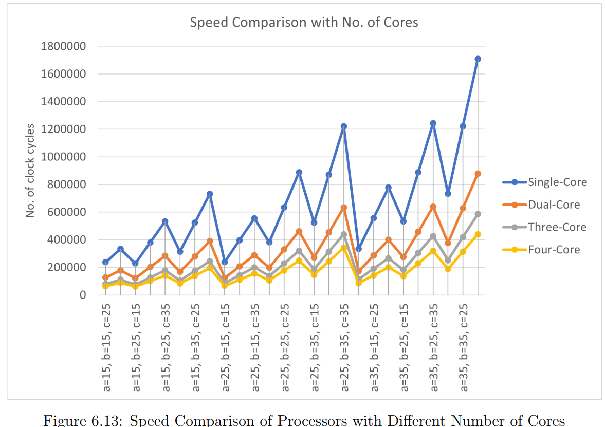

# Multicore_processor_matrix_multiply_Verilog_design
* This is a multi-core processor design for FPGA designed using Verilog language.
* In this design
  * Most of the important variables are parameterized. (Ex:- core-count of the multi-core processor, UART baudrate)
  * Every core can access only the part of the memory allocated to it.
  * Communication between laptop and FPGA happens using UART protocol.
* This is specially designed for matrix multiplication 
  * With current configurations, using single core upto 36x36 matrices can be multiplied.
* Top module (toFpga.v) is designed for DE-115 Altera FPGA board. (To use for a different board, use appropriate input/outputs names in the top module)
* Simulation codes are given for most of the modules. (except for the time count display module, UART system related modules) 
* ModelSim or QuestaSim can be used for simulations.

## Computational time vs Core count

## Synthesis procedure
1. Set the "CORE_COUNT" in the [toFpga.v](https://github.com/tharinduSamare/Multicore_processor_Matrix_multiply_verilog_design/blob/main/toFpga.v) to set the number of cores in the multi-core proecessor.
2. If requires to change the UART communication baud rate, set the "BAUD_RATE" in [to_Fpga.v](https://github.com/tharinduSamare/Multicore_processor_Matrix_multiply_verilog_design/blob/main/toFpga.v) and "baud_rate" in [processor_matrix_multiplication.py](https://github.com/tharinduSamare/Multicore_processor_Matrix_multiply_verilog_design/blob/main/python_code_for_synthesis/processor_matrix_multiplication.py). (Currently used value is 115200 for high speed transmission).
3. Compile and upload to the DE2-115 board.
4. Connect the RS-232 cable to the DE2-115. Make sure the "COM PORT" name is correct in [processor_matrix_multiplication_functions.py](https://github.com/tharinduSamare/Multicore_processor_Matrix_multiply_verilog_design/blob/main/python_code_for_synthesis/processor_matrix_multiplication_functions.py)
5. Go to the "UART_INS" state by "KEY[1] push button. 
6. Run the [processor_matrix_multiplication.py](https://github.com/tharinduSamare/Multicore_processor_Matrix_multiply_verilog_design/blob/main/python_code_for_synthesis/processor_matrix_multiplication.py)
7. Set the matrix dimensions and number of cores in the multi-core processor. 
8. Wait few seconds for the data transmission and matrix multiplication.
9. Clock counts for the multiplication is visible on the seven-segment display in decemal. 
10. Answer is verified within the laptop using a python function. (If there is an error it will be shown in the terminal.)
11. All the data are saved in text files in the [python_code_for_synthesis](https://github.com/tharinduSamare/Multicore_processor_Matrix_multiply_verilog_design/tree/main/python_code_for_synthesis) folder.
12. By pressing KEY[0] in the FPGA board, the system go to the initial (ready) state. (System reset)

## Simulation procedure
1. Open Quartus Prime software and set the required module as Top-level Entity. (ex:- register.v)
2. Do the Analysis & Elaboration.
3. Go to Assignments -> Settings -> EDA Tool Settings -> Simulation
4. Select the required test bench. (ex:- register_tb.v) and apply changes.
5. Go to Tools -> Run Simulation -> RTL Simulation.
6. Simulation will start in ModelSim or QuestaSim (as configured in Quartus Prime settings) then run untill the end and stop after at the end of the simulation.

### Note:-
* For the top level simulation [simulation_top.v](https://github.com/tharinduSamare/Multicore_processor_Matrix_multiply_verilog_design/blob/main/simulation_top.v) and [simulation_top_tb.v](https://github.com/tharinduSamare/Multicore_processor_Matrix_multiply_verilog_design/blob/main/simulation_top_tb.v) are used. 
* [INS_RAM.v](https://github.com/tharinduSamare/Multicore_processor_Matrix_multiply_verilog_design/blob/main/INS_RAM.v) and [DATA_RAM.v](https://github.com/tharinduSamare/Multicore_processor_Matrix_multiply_verilog_design/blob/main/DATA_RAM.v) are only used for simulation for below mentioned modules. They are similar to the [RAM.v](https://github.com/tharinduSamare/Multicore_processor_Matrix_multiply_verilog_design/blob/main/RAM.v) used for synthesis, but have simulation capabilities.
* Before simulate [simulation_top_tb.v](https://github.com/tharinduSamare/Multicore_processor_Matrix_multiply_verilog_design/blob/main/simulation_top_tb.v), [multi_core_processor_tb.v](https://github.com/tharinduSamare/Multicore_processor_Matrix_multiply_verilog_design/blob/main/multi_core_processor_tb.v), [processor_tb.v](https://github.com/tharinduSamare/Multicore_processor_Matrix_multiply_verilog_design/blob/main/processor_tb.v) please do the following steps.

1. Make sure that the paths for [9_ins_mem_tb.txt](https://github.com/tharinduSamare/Multicore_processor_Matrix_multiply_verilog_design/blob/main/matrix_generation_for_tb/9_ins_mem_tb.txt), [4_data_mem_tb.txt](https://github.com/tharinduSamare/Multicore_processor_Matrix_multiply_verilog_design/blob/main/matrix_generation_for_tb/4_data_mem_tb.txt), [11_data_mem_out.txt](https://github.com/tharinduSamare/Multicore_processor_Matrix_multiply_verilog_design/blob/main/matrix_generation_for_tb/11_data_mem_out.txt) are correctly set in [DATA_RAM.v](https://github.com/tharinduSamare/Multicore_processor_Matrix_multiply_verilog_design/blob/main/DATA_RAM.v), [INS_RAM.v](https://github.com/tharinduSamare/Multicore_processor_Matrix_multiply_verilog_design/blob/main/INS_RAM.v), [processor_tb.v](https://github.com/tharinduSamare/Multicore_processor_Matrix_multiply_verilog_design/blob/main/processor_tb.v), [multi_core_processor_tb.v](https://github.com/tharinduSamare/Multicore_processor_Matrix_multiply_verilog_design/blob/main/multi_core_processor_tb.v) modules.
2. Run [1_create_matrix.py](https://github.com/tharinduSamare/Multicore_processor_Matrix_multiply_verilog_design/blob/main/matrix_generation_for_tb/1_create_matrix.py) and give the matrix dimensions and core-count in the multi-core processor. (For processor_tb.v simulation core-count should be 1)
3. Run [3_dataCode_translate_for_tb.py](https://github.com/tharinduSamare/Multicore_processor_Matrix_multiply_verilog_design/blob/main/matrix_generation_for_tb/3_dataCode_translate_for_tb.py) to convert data (input matrices) into binary format.
4. Run [5_multiply.py](https://github.com/tharinduSamare/Multicore_processor_Matrix_multiply_verilog_design/blob/main/matrix_generation_for_tb/5_multiply.py) to multiply matrices using a python code to verify the answer from the simulation later.
5. Run [8_machinecode_translation_for_tb.py](https://github.com/tharinduSamare/Multicore_processor_Matrix_multiply_verilog_design/blob/main/matrix_generation_for_tb/8_machinecode_translation_for_tb.py) to convert assembly code into machine code.
6. Run the required verilog simulation in ModelSim/QuestaSim as mentioned above. (The binary values of the Data_memory will be stored in the [11_data_mem_out.txt](https://github.com/tharinduSamare/Multicore_processor_Matrix_multiply_verilog_design/blob/main/matrix_generation_for_tb/11_data_mem_out.txt) file. 
7. Run [12_convert_back.py](https://github.com/tharinduSamare/Multicore_processor_Matrix_multiply_verilog_design/blob/main/matrix_generation_for_tb/12_convert_back.py) to create the answer matrix from the previous binary file.
8. Run [14_compare_2_answers.py](https://github.com/tharinduSamare/Multicore_processor_Matrix_multiply_verilog_design/blob/main/matrix_generation_for_tb/14_compare_2_answers.py) to verify that the simulation is correct or not.

## Demonstration and documentation
* Demo of the multi-core processor can be found here. [Demonstration of the design](https://youtu.be/A8b6QhjnlR8)
* Documentation of the design - [Final report](https://github.com/tharinduSamare/Multicore_processor_Matrix_multiply_verilog_design/blob/main/FPGA%20based%20Multi-Core%20Processor_Final_Report.pdf) (Please note that the codes in the report's appendix section are little bit old and instead of them use the codes in the github repository.)
* The SystemVerilog implementation of the same design can be found [here](https://github.com/tharinduSamare/Multicore_processor_matrix_multiply_SystemVerilog_design)
